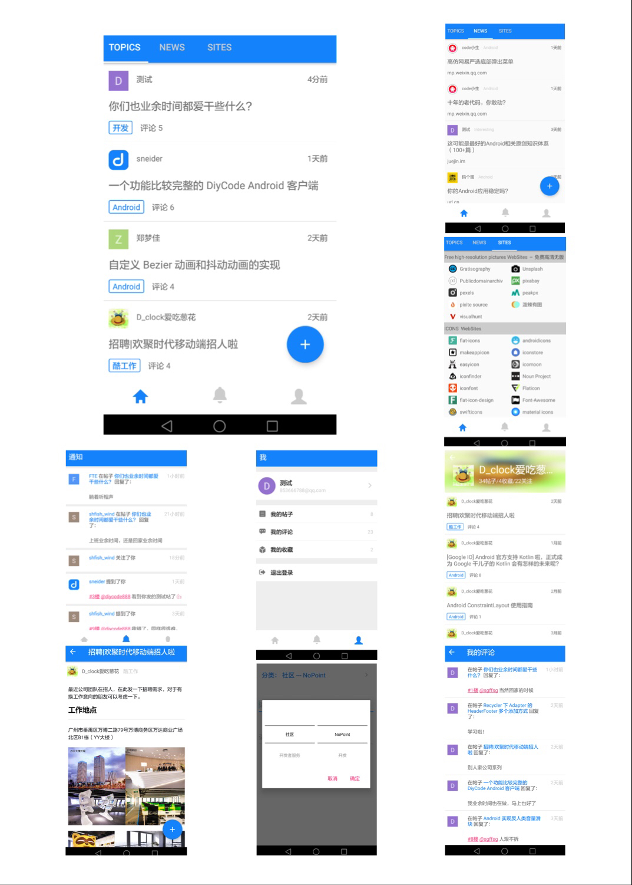

# DiyCode
又一个新的第三方DiyCode客户端

## 截图

## 下载
[DiyCode](./apk/DiyCode.apk)

## 感谢
[diycode](https://www.diycode.cc/)

[GcsSloop](https://github.com/GcsSloop) 的 [API SDK](https://github.com/GcsSloop/diycode-sdk)

## 参考
- [GcsSloop/diycode](https://github.com/GcsSloop/diycode)
- [plusend/DiyCode](https://github.com/plusend/DiyCode)

#### TODO
- [ ] 增加项目标签
- [ ] 增加Github Ranking标签
- [ ] 增加Wiki标签
- [ ] News回复功能
- [ ] 缓存信息
